# 🔐 McpPaywall

**Privacy-preserving Cashu eCash paywall middleware for Model Context Protocol (MCP) servers**

[](https://sup3r.cool/paywall)
[](https://github.com/slekrem/McpPaywall)
[](https://www.nuget.org/packages/McpPaywall.AspNetCore)
[](https://lightning.network/)

## 🌟 What is McpPaywall?

McpPaywall is an ASP.NET Core middleware that enables **micropayments for MCP servers** using **Cashu eCash** and **Lightning Network**. Monetize your Model Context Protocol tools, prompts, and resources with privacy-first payments starting from just 10 satoshis.

### ⚡ **Try the Live Demo**: [sup3r.cool/paywall](https://sup3r.cool/paywall)

**🎯 Perfect for:**
- AI tool developers wanting to monetize MCP servers
- Privacy-conscious payment integration
- Micropayment business models (pay-per-use)
- Lightning Network & Bitcoin developers
- Cashu eCash ecosystem projects

## ✨ Key Features

| Feature | Description |
|---------|-------------|
| 🛡️ **Automatic Protection** | ASP.NET Core middleware automatically secures all MCP endpoints |
| 🔒 **Privacy-First Payments** | Cashu eCash ensures anonymous, unlinkable transactions |
| ⚡ **Lightning Network** | Instant, low-fee Bitcoin payments via Lightning |
| 💰 **Micropayments** | Enable pay-per-use pricing from 1 satoshi |
| 🎯 **Token-based Access** | Secure JWT-style access tokens with expiration |
| 🔧 **Easy Integration** | 3-line setup in ASP.NET Core applications |
| 📊 **Built-in Analytics** | Payment statistics and user tracking |
| 🗃️ **SQLite Database** | Lightweight, embedded payment record storage |
| 🔌 **Extensible Providers** | Support custom payment providers beyond Cashu |
| 🎮 **Interactive Demo** | Live demo with real Lightning payments |

## 🚀 Quick Start

### 1. Install NuGet Package

```bash
dotnet add package McpPaywall.AspNetCore
```

### 2. Try the Live Demo

**👉 [sup3r.cool/paywall](https://sup3r.cool/paywall)** - Experience the complete payment flow

- See paywall in action (blocks unauthorized access)
- Create Lightning invoice (10 sats for 24h access)
- Pay with Cashu wallet ([Minibits](https://minibits.cash), [Cashu.me](https://cashu.me), [eNuts](https://enuts.cash))
- Get MCP connection URL for your AI client

## 💻 Integration

### Basic Setup (3 lines of code)

```csharp
using McpPaywall.AspNetCore.Extensions;

var builder = WebApplication.CreateBuilder(args);

// 1. Add MCP Paywall with Cashu eCash
builder.Services.AddMcpPaywallWithCashu(
    options =>
    {
        options.ConnectionString = "Data Source=paywall.db";
        options.DefaultAmount = 100;      // 100 satoshis (≈$0.03)
        options.DefaultUnit = "sat";
        options.TokenValidityDays = 7;    // 7-day access
        options.McpPath = "/mcp";         // Your MCP server endpoint
        options.Title = "My AI Tools";    // Paywall page title
        options.Description = "Premium AI tools for developers";
    },
    cashuOptions =>
    {
        cashuOptions.MintUrl = "https://stablenut.cashu.network"; // Cashu mint
        cashuOptions.StoreTokens = true;  // Store eCash tokens
    });

var app = builder.Build();

// 2. Enable paywall middleware
app.UseMcpPaywall();

// 3. Your existing MCP setup
app.UseRouting();
app.MapMcp("/mcp");  // Now protected by paywall!

app.Run();
```

### Payment Flow

1. **User tries to access MCP endpoint** → Gets 401 Unauthorized
2. **User visits paywall page** → Creates Lightning invoice  
3. **User pays with Cashu wallet** → Instant eCash privacy
4. **User gets access token** → 24/7 MCP server access
5. **AI client connects** → `wss://yourserver.com/mcp?accessToken=abc123`

## 🛠️ API Endpoints

| Method | Endpoint | Description |
|--------|----------|-------------|
| `POST` | `/paywall/create-invoice` | Generate Lightning payment invoice |
| `GET` | `/paywall/check-payment/{quoteId}` | Check payment status & get access token |
| `GET` | `/paywall/validate-token?token={token}` | Validate access token |
| `GET` | `/paywall/statistics` | Payment statistics (admin) |
| `POST` | `/paywall/cleanup` | Clean expired records (admin) |

### Example: Create Invoice

```bash
curl -X POST https://yourserver.com/paywall/create-invoice \
  -H "Content-Type: application/json" \
  -d '{"amount": 100, "unit": "sat", "description": "24h MCP access"}'
```

**Response:**
```json
{
  "quote": "abc123",
  "request": "lnbc100n1...",  // Lightning invoice
  "amount": 100,
  "unit": "sat",
  "expiresAt": "2024-01-20T12:00:00Z"
}
```

## ⚙️ Configuration

### McpPaywallOptions

```csharp
public class McpPaywallOptions
{
    public string ConnectionString { get; set; }     // SQLite: "Data Source=paywall.db"
    public bool EnsureDatabaseCreated { get; set; }  // Auto-create database
    
    // Payment Settings
    public decimal DefaultAmount { get; set; }       // Default: 10 sats
    public string DefaultUnit { get; set; }          // "sat", "usd", "eur"
    public int TokenValidityDays { get; set; }       // Token lifetime
    
    // Endpoint Configuration  
    public string McpPath { get; set; }              // "/mcp" (your MCP server)
    public string BasePath { get; set; }             // "/paywall" (paywall API)
    
    // UI Customization
    public string Title { get; set; }                // Paywall page title
    public string Description { get; set; }          // Paywall description
    
    // Features
    public bool EnableLogging { get; set; }          // Detailed payment logs
}
```

### Cashu eCash Options

```csharp
public class CashuPaymentOptions  
{
    public string MintUrl { get; set; }              // Cashu mint URL
    public bool StoreTokens { get; set; }            // Store eCash tokens
}
```

**Recommended Cashu Mints:**
- `https://stablenut.cashu.network` (Stable, reliable)
- `https://mint.minibits.cash` (Minibits wallet)
- `https://cashu.me` (Community mint)

## 🔄 How It Works

### Payment Flow



```mermaid
sequenceDiagram
    participant User as 🧑 User
    participant AI as 🤖 AI Client
    participant Paywall as 🔐 McpPaywall
    participant Cashu as ⚡ Cashu Mint
    participant MCP as 🛠️ MCP Server
    
    User->>AI: "Use premium tools"
    AI->>MCP: Connect to MCP server
    MCP->>Paywall: Check access token
    Paywall->>AI: ❌ 401 Unauthorized
    
    User->>Paywall: Visit paywall page
    Paywall->>User: 💳 Payment form
    User->>Paywall: Create invoice (100 sats)
    Paywall->>Cashu: Generate Lightning invoice
    Cashu->>Paywall: ⚡ Invoice + QR code
    Paywall->>User: Show invoice
    
    User->>Cashu: 💰 Pay with wallet
    Cashu->>Paywall: ✅ Payment confirmed
    Paywall->>User: 🎟️ Access token
    
    User->>AI: Add MCP connection URL
    AI->>MCP: Connect with access token
    MCP->>Paywall: Validate token
    Paywall->>MCP: ✅ Valid - grant access
    MCP->>AI: 🛠️ Tools, prompts, resources
    AI->>User: 🎉 Premium features available!
```

### Key Benefits

- **🔒 Privacy**: Cashu eCash provides anonymous payments
- **⚡ Instant**: Lightning Network enables immediate settlement
- **💰 Micropayments**: Monetize with payments as low as 1 satoshi
- **🛡️ Automatic**: Middleware handles all payment logic
- **🔧 Simple**: 3-line integration in existing ASP.NET Core apps

## 🎮 Interactive Demo

**👉 [sup3r.cool/paywall](https://sup3r.cool/paywall)**

### What the demo shows:

1. **🚫 Paywall Protection** - Try accessing MCP tools without payment
2. **💳 Lightning Invoice** - Generate real Lightning payment (10 sats)
3. **⚡ Cashu Payment** - Pay with privacy-preserving eCash
4. **🎟️ Access Token** - Get secure token for MCP access
5. **🛠️ Premium Tools** - Use weather, password, hash tools
6. **🔗 MCP Connection** - Copy URL for AI client integration

### Demo Tools (after payment):
- **GetWeather** - Simulated weather data for any city
- **GeneratePassword** - Secure password generation
- **CalculateHash** - SHA256 hash calculation
- **EmailTemplate** - Professional email templates  
- **MeetingAgenda** - Structured meeting planning
- **ProductivityTips** - Curated productivity advice
- **DevTools** - Development tool recommendations

### Run Demo Locally:

```bash
git clone https://github.com/slekrem/McpPaywall.git
cd McpPaywall/demo
dotnet run
# Visit http://localhost:5001/paywall
```

## 🏗️ Architecture

```
┌─────────────────┐    ┌──────────────────┐    ┌─────────────────┐
│   AI Client     │───▶│   McpPaywall     │───▶│   MCP Server    │
│ (Claude Desktop)│    │   Middleware     │    │  (Your Tools)   │ 
└─────────────────┘    └──────────────────┘    └─────────────────┘
                              │
                              ▼
                       ┌──────────────────┐
                       │  Cashu eCash     │
                       │  Lightning ⚡    │ 
                       └──────────────────┘
```

### Core Components:

| Component | Purpose |
|-----------|---------|
| **PaywallController** | REST API for payment operations |
| **McpAuthenticationMiddleware** | Automatic MCP endpoint protection |
| **PaywallService** | Business logic & token management |
| **CashuPaymentProvider** | Cashu eCash integration via DotNut |
| **PaywallDbContext** | SQLite database for payment records |

### Dependencies:

- **[Microsoft.AspNetCore.App](https://www.nuget.org/packages/Microsoft.AspNetCore.App)** - Web framework
- **[Microsoft.EntityFrameworkCore.Sqlite](https://www.nuget.org/packages/Microsoft.EntityFrameworkCore.Sqlite)** - Database
- **[DotNut](https://www.nuget.org/packages/DotNut)** - Cashu eCash protocol

## 🚀 Roadmap

- [ ] **Multiple Payment Providers** (Strike, OpenNode, BTCPay)
- [ ] **Subscription Models** (recurring payments)
- [ ] **Usage-based Pricing** (pay-per-call)
- [ ] **Rate Limiting** (requests per token)
- [ ] **Analytics Dashboard** (revenue tracking)
- [ ] **White-label UI** (custom branding)
- [ ] **Multi-tenant Support** (SaaS deployments)

## 🤝 Community

- **GitHub Issues**: [Report bugs & request features](https://github.com/slekrem/McpPaywall/issues)
- **Discussions**: [Community discussions](https://github.com/slekrem/McpPaywall/discussions)
- **Discord**: [Join our Discord](https://discord.gg/cashu) (Cashu community)
- **Twitter**: [@CashuBTC](https://twitter.com/CashuBTC)

## 📄 License

**MIT License** - Use commercially, modify freely, no warranty.

See [LICENSE](LICENSE) file for details.

## 🙏 Acknowledgments

- **[Cashu Protocol](https://cashu.space)** - Privacy-preserving eCash
- **[Lightning Network](https://lightning.network/)** - Bitcoin Layer 2
- **[Model Context Protocol](https://modelcontextprotocol.io/)** - AI tool integration
- **[DotNut](https://github.com/lontivero/DotNut)** - .NET Cashu implementation

---

**⭐ Star this repo if McpPaywall helps you monetize your AI tools!**

[](https://github.com/slekrem/McpPaywall)